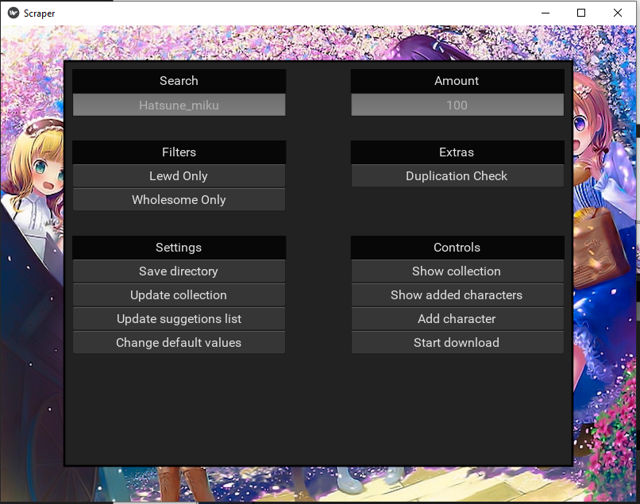
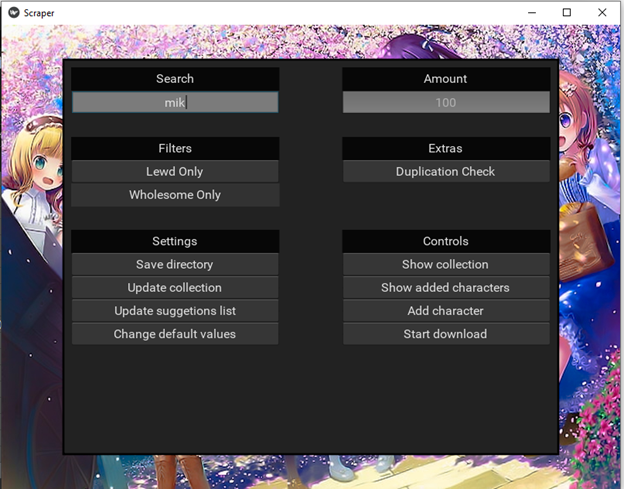
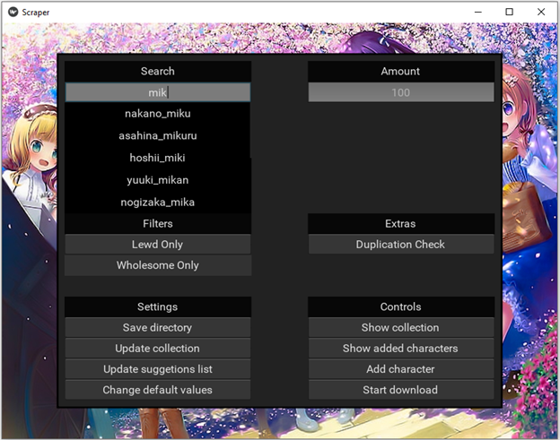

# Yandre-web-scraper

This app allows someone to download pictures of a certain anime character from the collection available at https://yande.re/. You can control how many pictures to download, and you can add multiple characters so that they can be downloaded at the same time.

You can also change the directory in which to store the downloaded pictures. The app will automatically create folders for each character in the save directory.

There are a few options for when downloading pictures. You can choose to download all pictures, only wholesome pictures, or only lewd pictures. There is also an option for duplication check, which will check to see if the picture already exists. Except this is a very simple check, if there is a minor change on a picture, i.e. size change, it will assume that is a different picture entirely. The duplication check will increase the time to download pictures exponentially. 

There is also a ‘download all’ option. Just type “ALL” into the character search bar and add the character. Depending on the default values of min_amount, and max_amount, it will download all characters fitting the criteria. For example, if min_amount was 100, and max_amount was 500. The app would download all characters that had an amount of at least 100 pictures stored on yand.re and would only download up to 500 pictures per character. 

# NOTE

You may need to update the suggetions list before recomandations appear. They should appear after three characters of text are inputed into the search bar. 

